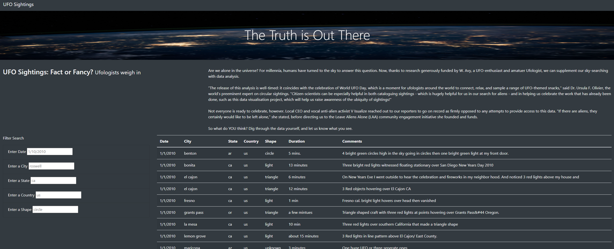

# UFOs - Module 12 Challenge
Chapel Hill - Data Science Bootcamp

## Overview of Project
For Module 12, HTML, CSS, and JavaScript were used to create and display a dynamic webpage containing data on UFO sightings. The table of UFO sightings, stored in a JavaScript array, can be altered with user input. This allows users to filter the data as they wish and display the desired results.

## Results
See the webpage here: [UFO GitHub Pages Website](https://sburton7395.github.io/UFOs/)
Below the introductory paragraph lie the filters - on the left - and the table - on the right. Users can filter by date, city, state, country, and shape. The following are filter options for each category:
- Dates range from 1/1/2010 to 1/13/2010.
- City options are Ackerman, Albuquerque, Alma, Anchorage, Anderson, Antioch, Aspen, Atlanta, Baker, Bakersfield, Ben Wheeler, Benton, Boca Raton, Bonita, Boulder, Buffalo, Butler, Cary, Cedar Rapids, Ceres, Chula Vista, Cincinnati, Cleveland, Clinton, Colonia, Crestview, Deep Run, Edgartown, El Cajon, Eugene, Eunice, Falcon, Fayetteville, Fort Myers, Fort Worth, Francis Creek, Freedom (Watsonville), Fresno, Glen Spey, Grants Pass, Gulf Breeze, Hancock, Haverhill, Ingleside (Canada), Jasper, Joplin, La Mesa, Lakeland, Leatherwood, Lemon Grove, Loceland, Lompoc, London (Canada), Madison, Mansfield, Maricopa, Mason, Middleburg, Naples, National City, New Paltz, Norton, Orange, Pacific Palisades, Paducah, Park City, Pasadena, Phoenix, Port Saint Lucie, Pratt, Princeton, Reedville, Rockwell, Round Rock, Sacramento, Saline, San Diego, San Jacinto, San Pablo, Santa Fe Springs, Searcy, Seattle, Southampton, Spring Valley, Springfield, St. Louis, Taunton, Tomball, Tularosa, Uxbridge, Walworth, Waukesha, Waxhaw, West Boylston, Westbrook, White Oak, Whittier, Wichita, Willow, Windham, and Woodbridge.
- State options are AK, AL, AR, AZ, CA, CO, CT, FL, GA, IA, IN, KS, KY, LA, MA, MD, MI, MO, MS, NC, NH, NJ, NM, NY, OH, ON, OR, PA, SC, TN, TX, VA, WA, WI, WV.
- Country options are CA and US.
- Shape options are changing, chevron, cigar, circle, cross, cylinder, disk, fireball, flash, formation, light, other, oval, rectangle, sphere, teardrop, triangle, and unknown.

Once a user has added input to a filter field, they should press tab or enter, or click outside of the filter box to have the website reload with the filter in place.

## Summary
While this website is a good start, there are several ways to improve the table, layout, and search functions. The current data table is not very large, but - assuming that this is a prototype and would eventually be applied to a larget dataset - would have a long loading time since the webpage loads the entire table at once. A feature like lazy loading would help to solve that issue, only loading to a certain point until a user scrolls far down enough to necessitate loading more table rows. In terms of layout, a full separation and delineation between areas of the webpage may make it easier to navigate. For instance, adding a box to surround the filter area would draw attention to that section, making the section clearer to the user (a larger and bolded font for the "Filter Search" title would also be helpful). For the search itself, changing it from users typing filters free-hand to a drop-down menu would add significant usability; users trying the site for the first time do not know available options for dates, cities, etc. without looking through the entire dataset first.
